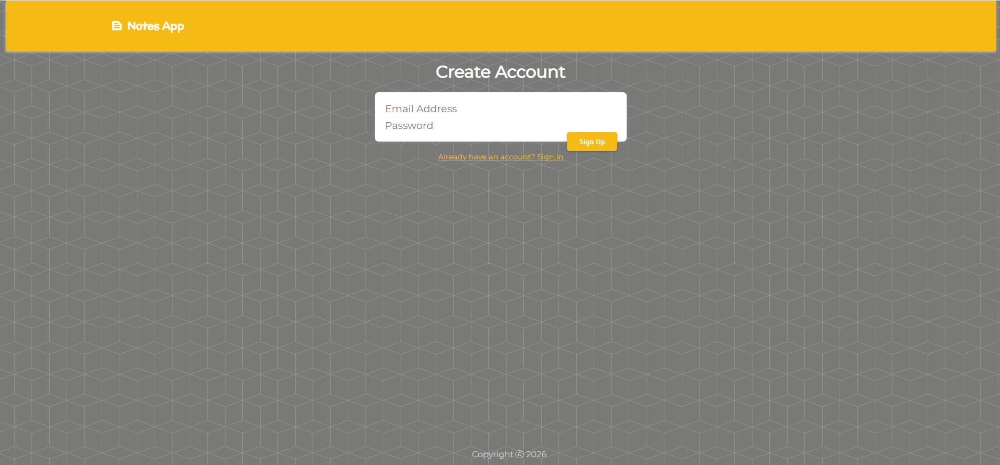
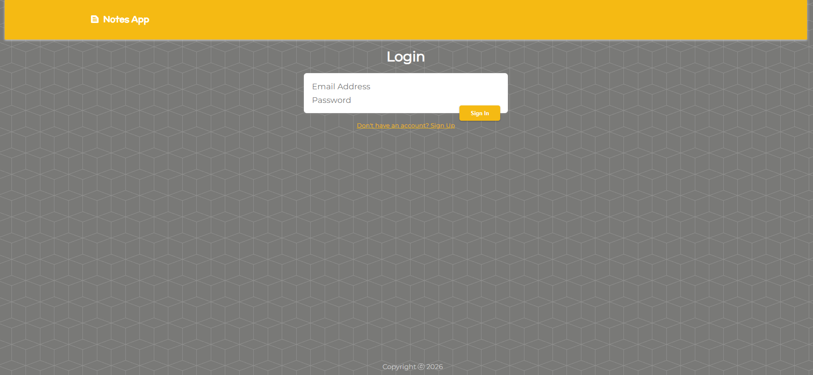
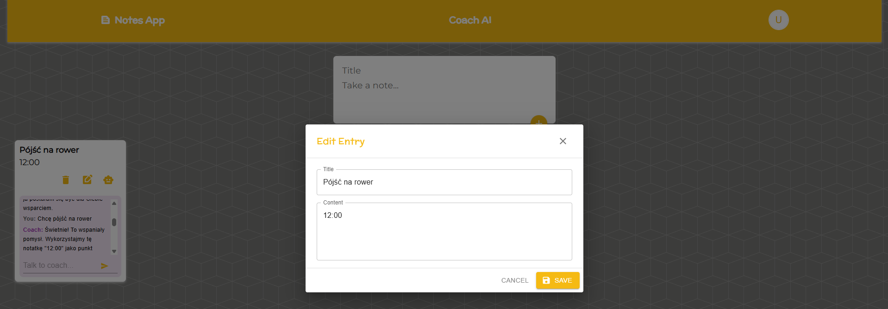
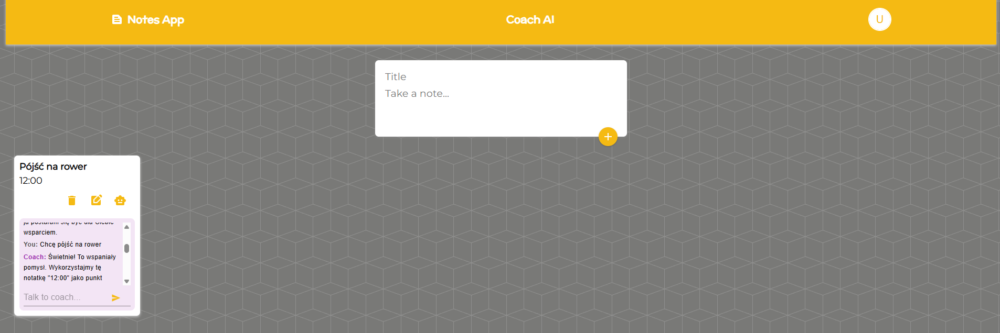
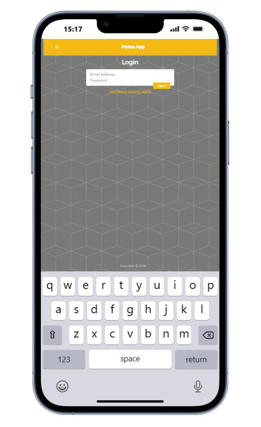
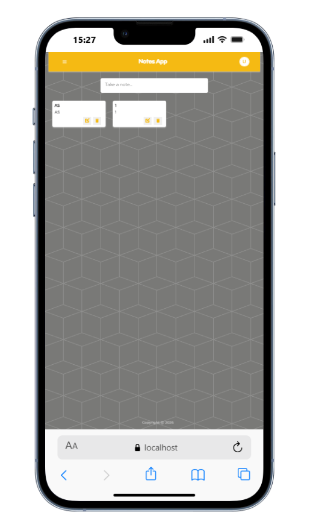
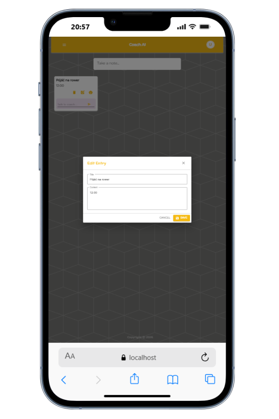
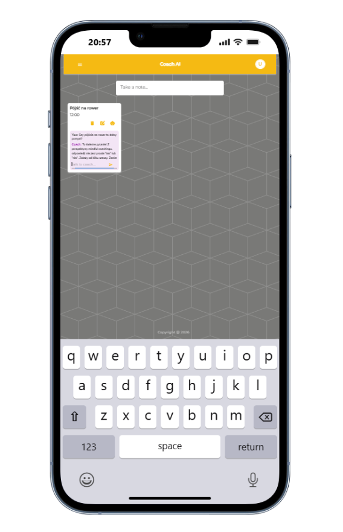

# Notes App
This application will help you manage your notes. Fullstack application connected backend and frontend connected with AI

# Project Name
- This application will help you manage your notes. You can add notes, edit and delete every single note. Registration and subsequent logging in at any time will allow you to conveniently access your data. Addition of Gemini AI Model that propose new ideas, notes consistent with your previous notes. Keeping a notebook never be more useful and excited.

# Installation

- npm install command to create node_modules with all features from package.json

## Table of Contents
* [General Info](#general-information)
* [Technologies Used](#technologies-used)
* [Features](#features)
* [Screenshots](#screenshots)
* [Acknowledgements](#acknowledgements)
* [Contact](#contact)

## General Information
- This is my first solution of React, NodeJS, REST API and Express. An excellent exercise in combining there languages, frameworks. Not forgetting about responsiveness. PostgreSQL and Backend (Node.js/Express) will allow all functionalities to function properly and be saved and restored in the later operation of the application, with access to them at any time. Addition of Gemini AI Model that propose new ideas, notes consistent with your previous notes.

## Technologies Used
- HTML5 Markup
- CSS 
- RWD - Responsive Web Design 
- JavaScript
- React
- NodeJS
- REST API
- Express
- PostgreSQL
- Google Gemini AI Model 2.5

## Features

## Screenshots

## Acknowledgements

## Contact
Created by [@mr_cyclist] - contact me!
